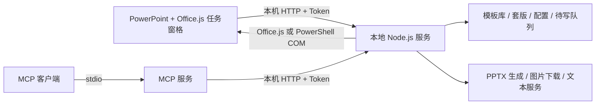

# 模板助手技术文档

> 当前实现基线：2026-08-28。安装与使用步骤见[安装说明](../安装说明.md)。

## 1. 产品与架构

模板助手由三部分组成：

1. **PowerPoint 任务窗格**：TypeScript、Vite、Office.js，负责读取当前幻灯片、模板标注、生成向导和写回。
2. **本地服务**：Node.js、Express、PptxGenJS、JSZip，负责模板与套版存储、图片和文本服务代理、PPTX 生成、版本诊断与安全控制。发布时打包为单文件 Windows 可执行程序。
3. **MCP 服务**：stdio JSON-RPC 服务，把模板、套版、待写队列和 PowerPoint 上下文提供给支持 MCP 的外部 AI 客户端。



服务默认只监听 `127.0.0.1:3788`。默认端口被占用时会依次尝试后续端口，并把实际端口写入运行时文件。Office 清单仍以默认端口为入口，因此正式安装前应避免 3788 被长期占用。

## 2. 主要功能

### 模板库

- 按分类浏览模板，切换网格密度并查看结构预览
- 编辑、删除、恢复和彻底删除模板
- 保存历史版本，可查看、恢复、设为当前版本或删除旧版本
- 接收 MCP 或后端生成的待写内容

### 保存模板

- 读取当前幻灯片中的元素、背景、固定图片和表格
- 用内置规则推荐元素角色与语义；可选调用文本服务增强分析
- 标记 AI 图片位、AI 文本位、手动变量位、固定元素和数据内容
- 同名更新时继承已有标记，后台补存精确 XML 样式和预览

### 单页生成

- 填写变量、生成或编辑文字、搜索并选择图片
- 支持图片裁剪、背景策略和表格内容适配
- 生成预览后插入当前 PowerPoint；失败时进入待写队列

### 套版

- 把多个模板按顺序组成一份演示文稿
- 每页可引用最新模板或固定模板版本
- 一次填写多页内容、生成多页 PPTX 并写入 PowerPoint
- 支持套版编辑、预览和回收站

### AI 配置与图源

- 文本服务使用 OpenAI 兼容接口
- 内置和预置多个图片来源，也可导入自定义 JSON API
- 自定义图源支持 Headers、Cookies、字段映射、分页占位符和连接测试
- 界面语言、字号、元素定位颜色和显示时长可配置；语言支持中文和 English

## 3. 数据与文件

| 数据 | 默认位置 | 说明 |
| --- | --- | --- |
| 模板与套版 | `%USERPROFILE%\Documents\PPT模板库` | 模板、版本、预览、回收站和套版共用根目录 |
| 配置与运行时 | `%APPDATA%\ppt-ai-addin` | 配置、一次性 Token、实际端口、待写队列、MCP 心跳 |
| 下载图片 | `%USERPROFILE%\Documents\PPT下载图库` | 图片下载与缓存 |
| 安装目录 | `%LOCALAPPDATA%\PPT-AI-Addin` | 后端程序、前端静态资源、清单和发布清单 |

可用环境变量覆盖部分路径：`PPT_TEMPLATE_ROOT`、`PPT_DOWNLOAD_DIR`、`PPT_DIST_DIR` 和 `PPT_PORT`。

## 4. 本地 API

除健康检查、运行时引导和预览图外，`/api` 请求需要 `X-Auth-Token`。主要接口分组如下：

| 分组 | 主要用途 |
| --- | --- |
| `/api/health`、`/api/version`、`/api/runtime` | 存活、版本、端口和部署诊断 |
| `/api/templates` | 模板列表、保存、读取、版本、预览和回收站 |
| `/api/decks` | 套版列表、保存、构建、预览和回收站 |
| `/api/slides` | 单页构建、文件解析、样式回读和调试导出 |
| `/api/ai` | 单页/套版生成与待写队列 |
| `/api/images`（含 `/api/images/sources`） | 图片搜索、下载、图源管理与测试 |
| `/api/text`、`/api/analyze` | 文本生成和模板分析 |
| `/api/context` | 当前演示文稿、当前页、指定页和页面检查 |
| `/api/config`、`/api/perf` | 配置、性能统计和诊断日志 |

接口属于本地实现细节，目前没有单独承诺稳定的外部 HTTP SDK。外部 AI 集成优先使用 MCP。

## 5. MCP

MCP 入口为 `server/mcp/index.js`，运行时需要 Node.js 24+。当前提供 15 个工具：

- 模板与生成：`list_templates`、`get_template`、`fit_table`、`generate_slide`、`save_template`
- 套版：`list_decks`、`get_deck`、`generate_deck`
- 待写队列：`list_pending`、`write_slide`、`delete_pending`
- PowerPoint 上下文：`get_presentation_context`、`get_current_slide`、`get_slide`、`inspect_slide`

另提供 `ppt-gen-page` 和 `ppt-gen-deck` 两个提示模板。写入当前 PowerPoint 依赖桌面 PowerPoint 正在运行并打开目标文稿；COM 写入失败时，结果仍可在任务窗格待写队列中处理。

## 6. 安全设计

- 服务只监听回环地址，CORS 仅允许本机回环来源
- 每次启动生成新的运行时 Token，除白名单外的 API 必须鉴权
- 鉴权在 JSON 请求体解析前执行，降低未授权大请求的内存消耗
- Windows 下 API Key 和自定义图源 Key 使用当前用户 DPAPI 加密
- 图片下载检查协议、DNS/IP、重定向、超时、体积、MIME 和文件魔数，默认阻止内网地址
- 自定义图源只有显式设置 `allowPrivate: true` 才能访问本机或内网服务

已知依赖审计例外和报告方式见[安全说明](../SECURITY.md)。

## 7. 构建、版本与发布

根目录执行 `npm run release`。发布脚本会：

1. 生成 `YYYY.MM.DD.NN` 应用版本并写入后端和前端构建信息；
2. 执行后端测试和黄金路径 E2E；
3. 执行前端类型检查与生产构建；
4. 把后端打包为 `dist-exe/ppt-ai-addin.exe`；
5. 更新 `release.json` 的产物大小、哈希和测试状态。

`manifest.xml` 的 Office 清单版本保持固定，避免已信任清单因发布构建号变化而失效；应用版本由 `/api/version` 和 `release.json` 管理。

CI 配置位于 `.github/workflows/ci.yml`，在 Windows 环境执行后端测试、文件级 E2E、前端测试、类型检查和构建。

## 8. 验证基线

发布前必须通过：

```powershell
cd server
npm test
npm run e2e:file

cd ..\addin
npm test
node node_modules/typescript/bin/tsc --noEmit
npm run build
```

测试数量会随功能变化，最终结果以当前命令和 `release.json` 为准，不在本文维护容易失效的固定总数。

## 9. 已知限制

- 仅面向 Windows 桌面版 PowerPoint；未覆盖 macOS、PowerPoint 网页版和移动端
- Office.js 与 PowerPoint COM 的实际写入行为仍需在目标 Office 版本上做发布前冒烟验证
- PowerPoint 与本地服务权限级别不一致时，COM 直接插入可能失败，需要任务窗格待写队列兜底
- 页面解析类图片来源可能受网站结构、网络环境和服务条款变化影响；公开发布时应优先使用合规 API 图源
- 原生图表、SmartArt 和部分复杂 PPT XML 效果无法保证完全还原
- 当前多语言覆盖插件界面主要文本；模板内容、用户输入、AI 生成内容和后端日志不自动翻译
